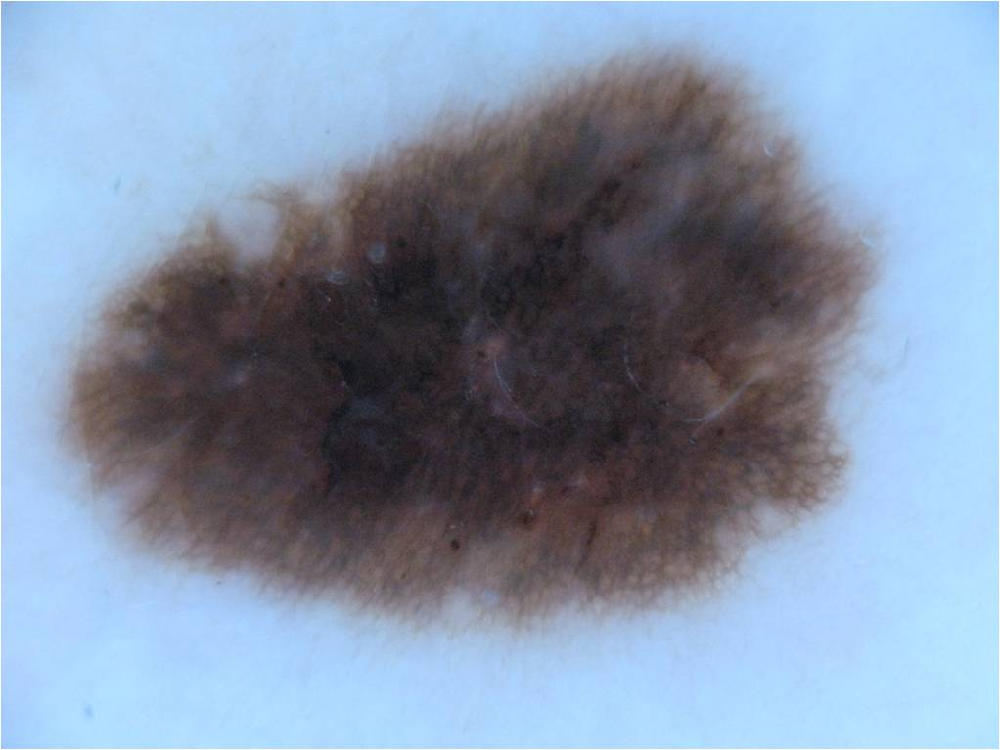

# Different CNN Architectures for Medical Image Segmentation

---

### Author
Arpit Aggarwal

### Introduction to the Project
In this project, different CNN Architectures like FCN-8, FCN-16, FCN-32, U-Net were used for the task of medical image segmentation. The input to the CNN networks was a (224 x 224 x 3) image and the number of classes were 1. The CNN architectures were implemented in PyTorch and the loss function was Binary Cross Entropy(BCE) Loss. The hyperparameters to be tuned were: Number of epochs(e), Learning Rate(lr), weight decay(wd) and batch size(bs). 

### Data
The custom dataset used was ISIC 2018 for melanoma detection. The dataset can be downloaded from here: https://challenge2018.isic-archive.com/task1/training/
 
 

### Architectures Used
Different CNN architectures used for the task of image segmentation are given below:

1. FCN-8: Encoder/Backbone used is VGG-16.
2. FCN-16: Encoder/Backbone used is VGG-16.
3. FCN-32: Encoder/Backbone used is VGG-16.
4. U-Net: Encoder/Backbone used is VGG-16.

### Software Required
To run the jupyter notebooks, use Python 3. Standard libraries like Numpy and PyTorch are used.

### Credits
The following links were helpful for this project:
1. https://github.com/pytorch/tutorials
2. https://github.com/bodokaiser/piwise/
3. https://github.com/meetshah1995/pytorch-semseg/
