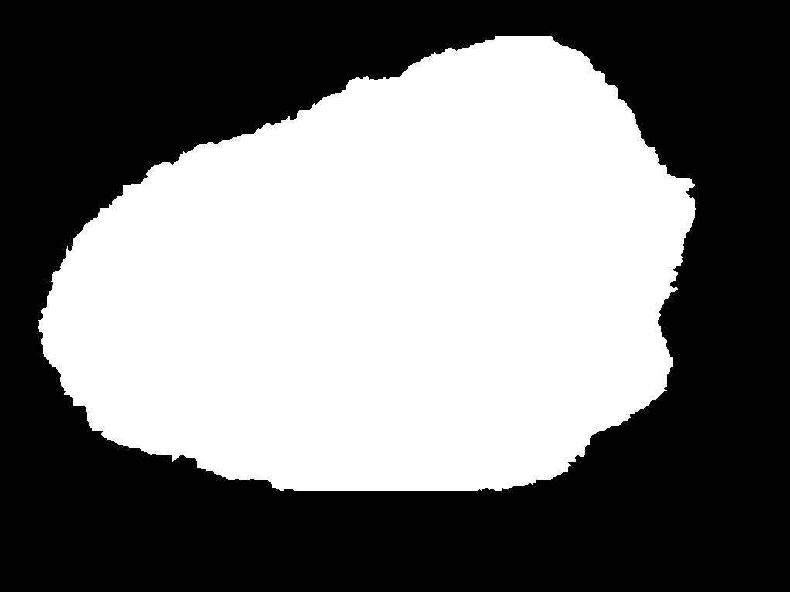

# CNN Architectures for Medical Image Segmentation

---

### Author
Arpit Aggarwal

### Introduction to the Project
In this project, different CNN Architectures like FCN-8, FCN-16, FCN-32, U-Net and SegNet were used for the task of medical image segmentation. The input to the CNN networks was a (224 x 224 x 3) image and the number of classes were 1. The CNN architectures were implemented in PyTorch and the loss function was Binary Cross Entropy(BCE) Loss. The hyperparameters to be tuned were: Number of epochs(e), Learning Rate(lr), weight decay(wd) and batch size(bs). 

### Data
The custom dataset used was ISIC 2018 for melanoma detection. The dataset can be downloaded from here: https://challenge2018.isic-archive.com/task1/training/

  

 

  

### Architectures Used
Different CNN architectures used for the task of medical image segmentation are given below: 
FCN-8, FCN-16, FCN-32, U-Net and SegNet

### Results
The results after using different CNN architectures are given below:

1. <b>U-Net</b> 

Training Accuracy = 98.01% and Validation Accuracy = 96.63% (e = 100, lr = 0.001, bs = 8) 

2. <b>FCN-8</b> 

Training Accuracy = 99.27% and Validation Accuracy = 96.73% (e = 100, lr = 0.001, bs = 8) 

3. <b>FCN-16</b> 

Training Accuracy = 99.27% and Validation Accuracy = 96.73% (e = 100, lr = 0.001, bs = 8) 

4. <b>FCN-32</b> 

Training Accuracy = 99.27% and Validation Accuracy = 96.73% (e = 100, lr = 0.001, bs = 8) 

5. <b>SegNet</b> 

Training Accuracy = 99.27% and Validation Accuracy = 96.73% (e = 100, lr = 0.001, bs = 8) 

### Software Required
To run the jupyter notebooks, use Python 3. Standard libraries like Numpy and PyTorch are used.

### Credits
The following links were helpful for this project:
1. https://github.com/pytorch/tutorials
2. https://github.com/bodokaiser/piwise/
3. https://github.com/meetshah1995/pytorch-semseg/
